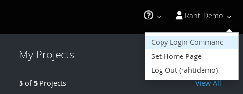

# OpenShift CLI
1. Log in to Rahti (at https://rahti.csc.fi:8443). Authorize command line
   session by clicking top right username → Copy Login Command:

   

   And pasting the text to command line:

   ```bash
   $ oc login https://rahti.csc.fi:8443 --token=<token>

   Logged into "https://rahti.csc.fi:8443" as "rahtidemo" using the token provided.
   ...
   ```

2. Create a project:

   ```bash
   oc new-project course-training-<number> --description="csc_project: xxxx"
   ```

3. The project should be now visible on the web console and it should get
   listed with `oc projects` command.

   ```bash
   $ oc projects
   You have one project on this server: "course-rahti-<number>".

   Using project "course-rahti-<number>" on server "https://rahti.csc.fi:8443".

## DeploymentConfig 
* Create a DeploymentConfig file that will spawn a pod running image `openshift/hello-openshift`. Name it hello-openshift and label it app: hello-openshift. Apply the same label app: hello-openshift to the pods to be spawned as well.

  *`dc.yaml`*:

  ```yaml
  apiVersion: apps.openshift.io/v1
  kind: DeploymentConfig
  metadata:
    labels:
      app: hello-openshift
    name: hello-openshift
  spec:
    replicas: 1
    selector:
      app: hello-openshift
    template:
      metadata:
        labels:
          app: hello-openshift
      spec:
        containers:
        - image: openshift/hello-openshift:latest
          name: hello-openshift
          ports:
          - containerPort: 8080
  ```
  ```bash
  oc create -f dc.yaml
  ```

## Service
* Create a Service object file that will redirect traffic internally to the pod.

  *`service.yaml`*:

  ```yaml
  apiVersion: v1
  kind: Service
  metadata:
    labels:
      app: hello-openshift
    name: hello-openshift
  spec:
    selector:
      app: hello-openshift # Must match the DeploymentConfig
    ports:
    - name: 8080-tcp
      port: 8080
      protocol: TCP
      targetPort: 8080
    - name: 8888-tcp
      port: 8888
      protocol: TCP
      targetPort: 8888
  ```
  ```bash
  oc create -f service.yaml
  ```

## Route
* Create a Route file and expose the Service to internet at 'hello-openshift-xx.rahtiapp.fi'. (Where 'xx' is the number of the training account you are holding).

  *`route.yaml`*:

  ```yaml
  apiVersion: route.openshift.io/v1
  kind: Route
  metadata:
    labels:
      app: hello-openshift
    name: hello-openshift
  spec:
    host: hello-openshift-tutorial.rahtiapp.fi # Change the name
    port:
      targetPort: 8080-tcp # Must match your service port name
    tls:
      termination: edge
      insecureEdgeTerminationPolicy: Redirect
    to:
      kind: Service
      name: hello-openshift # Must match your service name
  ```
  ```bash
  oc create -f route.yaml
  ```

## Accessing the application
Now you deployed your `Route`, you can access the application through the address `https://hello-rahti-xx.rahtiapp.fi` and you should see "Hello Openshift!"

## Cleanup
```sh
oc delete all -l app=hello-openshift
```
or
```sh
oc delete -f dc.yaml -f service.yaml -f route.yaml
```