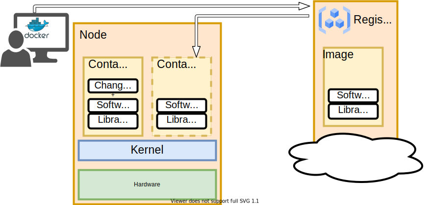
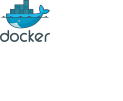
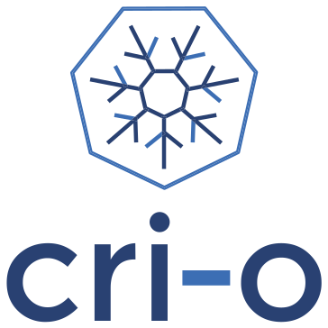

layout: false
class: topicslide

.topic[

# Basics of Containers 

]

---

# Containers (Software vs real life)

.container[
.col[
Before
.center[

]

* **Different installation methods**: compile from source, installation wizard, rpm/deb package, etc
* **Libraries dependency** problems: untested, hard to find, outdated, etc
* **No security** isolation
* **No assured** resources
]
.col[

After

.center[

]

* **Standard image registry**, fast and standard deployment.
* **Uniform resource identifier**
  * `host/name:version`
* **Included library dependencies** in the container
* **Isolated** from the rest of the system
* **Assured resources**

]]

---

# What is a container?

A **OS-level virtualization** software package. Allows **easy** and **reliable** development and deployment. 
* Uses features of the Linux kernel (_cgroups_ and _namespaces_) to provide an isolated environment.

.center[]

---

# Container characteristics

.container[.col[

* All containers running in the same hardware are run by a single operating system kernel and therefore use **fewer resources than virtual machines**.

.right[]

].col[

* Containers are stateless.
  * Any change to a file, done inside a container image will be **lost**.
  * Necessary to use **external volumes** to save data or configuration

* Container images are stored in "container registries"
  * Docker hub is the default registry.
      * <https://hub.docker.com>
  * Rahti provides a private registry.
      * <https://registry-console.rahti.csc.fi/>

]]

---

# Container Runtimes

Container runtimes are a set of PaaS products that use **OS-level virtualization** to deliver **software in packages** called containers\[2\].footnote[\[2\]: <https://en.wikipedia.org/wiki/OS-level_virtualization>, \[3\]: [OCI Containers](https://opencontainers.org/)], in a user friendly manner.

.container[
.col[

There are few OCI \[3\] compatible container runtimes, Docker is currently the most famous, but others also exist:
  * [CRI-O](https://cri-o.io/), "Lightweight Container Runtime for Kubernetes".
  * [Podman](https://podman.io/), daemonless container engine that can be run in rootless mode.

[Singularity](https://en.wikipedia.org/wiki/Singularity_%28software%29) is a non OCI container runtime, mainly used in the HPC world. It is out of scope for this copurse.

]
.col[

.center[]
.center[]

]]

---

.container[
.col60[

# Container Runtimes II

With a container runtime you usually can:

]
.col[

.center[]

]]

||Docker|Podman|
|:-|:-|:-|
|Run|`sudo docker run <image>`|`podman run <image>`|
|Build|`sudo docker build . --tag <image>`|`podman build . --tag <image>`|
|Pull (from registry)|`sudo docker pull <image>`|`podman pull <image>`|
|Push (to registry)|`sudo docker push <image>`|`podman push <image>`|
|History|`sudo docker history <image>`|`podman history <image>`|

They use Linux Kernel features like `cgroups` and `namespaces`.

More info on [how to run containers in Linux](https://cloud-solutions.a3s.fi/how-to-run-containers-in-Linux/index.html)

